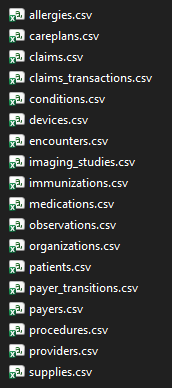
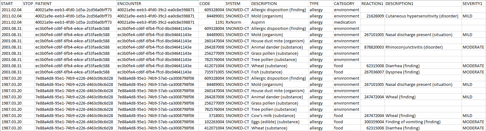
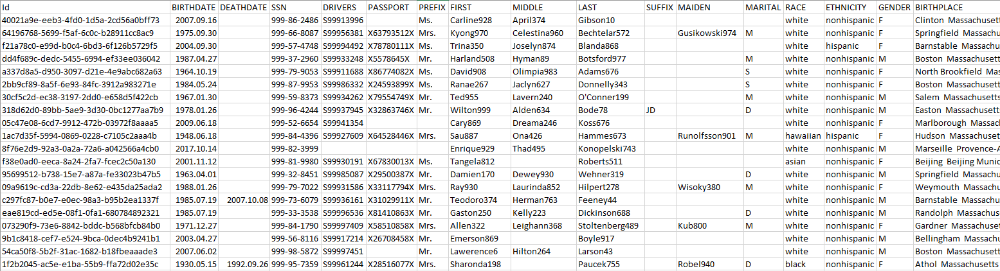
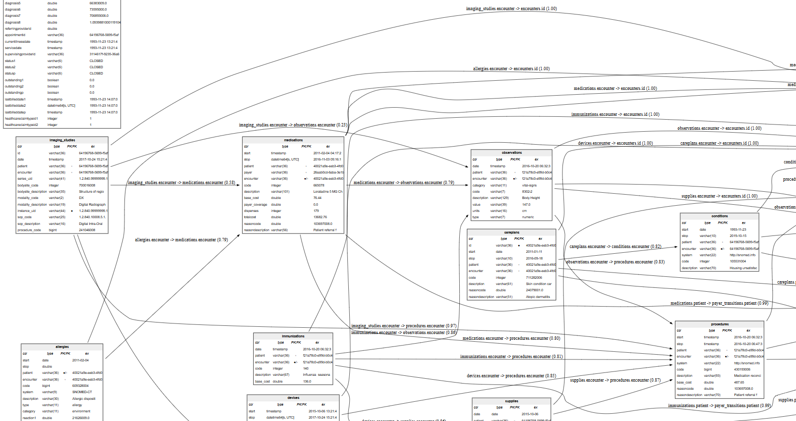
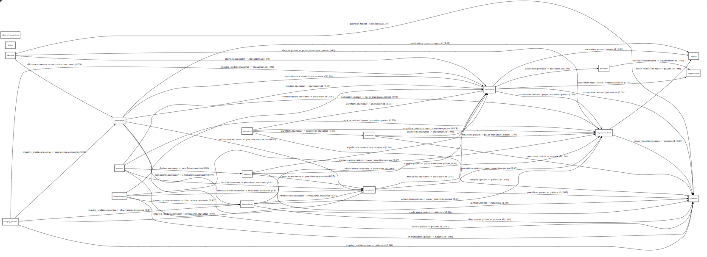

# Problem

1. You have a folder of csv's where each csv is from a database table.\

2. They are from multiple databases with different primary (surrogate) keys.
3. Column values are all stored as text.
4. There are dimension, fact and possibly link tables.\


5. You need to understand what each table is recording, and if and how these tables link to each other.

Data illustrated above is synthetic data from https://synthea.mitre.org/downloads, specifically:  
https://synthetichealth.github.io/synthea-sample-data/downloads/latest/synthea_sample_data_csv_latest.zip

# Course of Action

1. To establish linkage, you need to infer what is the primary key column in a table, and the equivalent foreign key in all the other tables. See [Key Inference](#Key-Inference)
2. To better understand what the table is recording, you need to infer the data type from the text values.

# Entity-Relationship Diagram Pipeline

A pipeline to profile CSV tables, infer primary/foreign keys and data types and render:

- An Entity-Relationship Diagram (`ERD.svg`) with table schemas and links.
- An edges diagram (`EDGES.svg`) based on the generated `edges.csv`.
- A schema table (`tables_schema.csv`) when ERD rendering is enabled.

## Quick Start

1. Create the environment (online build machine):
   - Conda (recommended): `conda env create -f environment.yml`
   - Activate: `conda activate erd-env`

2. Configure inputs in `config.yml`:
   - `input_csv_dir`: path to your CSV folder
   - `csv_glob`: filename pattern for CSVs
   - `output_dir`: where artifacts are written

   Rendering toggles:
   - `render_erd`: when true, produces `tables_schema.csv` and `ERD.svg`
   - `render_edges_diagram`: when true, produces `EDGES.svg`

3. Run the pipeline:
   - `python run_erd_pipeline.py --config config.yml`

4. Outputs (under `output_dir`):
   - `edges.csv` (always)
   - `EDGES.svg` (if `render_edges_diagram: true`)
   - `ERD.svg` , `tables_schema.csv` (if `render_erd: true`)
   - `pipeline.log`

## Offline (air-gapped) Deployment

### Conda environment set-up

- On the 
*online* machine:
  1. run `conda pack -n erd-env -o erd-env.tar.gz` to pack your conda environment
  2. download this repository as a zip file
  3. you will now have these 2 files:
      ```
      erd-env.tar.gz
      entity-relationship-main.zip
      ```
  4. transfer them to your offline machine with your physical transfer method
- On the *offline (air-gapped)* target machine:
  1. place the `erd-env.tar.gz` file into your target folder, e.g. `erd`
  2. unzip the `entity-relationship-main.zip` repository contents also into the same folder, e.g. `erd`
  3. locate and double-click `unpack_env.bat` to execute the batch file which:\
      a. extracts `erd-env.tar.gz` to an `erd-env` subfolder\
      b. runs conda-unpack (this sets up the standalone conda environment with python and packages installed)
- Folder structure after above steps:
  ```
  erd
  ├ erd-env
  ├ .gitattributes
  ├ .gitignore
  ├ config.yml
  ├ environment.yml
  ├ erd-env.tar.gz
  ├ README.md
  ├ run_erd_pipeline.py
  ├ run_pipeline.bat
  └ unpack_env.bat
  ```

### Run script

- open `config.yml` file and change the `input_csv_dir` value to point to the folder where your `*.csv` files are
- double-click `run_pipeline.bat`, which
  - activates the `erd-env` conda environment
  - runs the `run_erd_pipeline.py` script
- you should see something like this:
  ```
  [2025-11-09 19:27:50] INFO: Logging initialized -> output\pipeline.log
  [2025-11-09 19:27:50] INFO: Starting ERD pipeline (exact notebook logic)
  [2025-11-09 19:27:50] INFO: Loaded allergies.csv -> table 'allergies' (rows=85, cols=15)
  [2025-11-09 19:27:50] INFO: Loaded careplans.csv -> table 'careplans' (rows=337, cols=9)
  [2025-11-09 19:27:50] INFO: Loaded claims.csv -> table 'claims' (rows=12115, cols=31)
  [2025-11-09 19:27:52] INFO: Loaded claims_transactions.csv -> table 'claims_transactions' (rows=104272, cols=33)
  [2025-11-09 19:27:52] INFO: Loaded conditions.csv -> table 'conditions' (rows=4294, cols=7)
  [2025-11-09 19:27:52] INFO: Loaded devices.csv -> table 'devices' (rows=640, cols=7)
  [2025-11-09 19:27:52] INFO: Loaded encounters.csv -> table 'encounters' (rows=6414, cols=15)
  [2025-11-09 19:27:52] INFO: Loaded imaging_studies.csv -> table 'imaging_studies' (rows=29193, cols=13)
  [2025-11-09 19:27:52] INFO: Loaded immunizations.csv -> table 'immunizations' (rows=1535, cols=6)
  [2025-11-09 19:27:52] INFO: Loaded medications.csv -> table 'medications' (rows=5701, cols=13)
  [2025-11-09 19:27:52] INFO: Loaded observations.csv -> table 'observations' (rows=100980, cols=9)
  [2025-11-09 19:27:52] INFO: Loaded organizations.csv -> table 'organizations' (rows=273, cols=11)
  [2025-11-09 19:27:52] INFO: Loaded patients.csv -> table 'patients' (rows=109, cols=28)
  [2025-11-09 19:27:52] INFO: Loaded payers.csv -> table 'payers' (rows=10, cols=22)
  [2025-11-09 19:27:52] INFO: Loaded payer_transitions.csv -> table 'payer_transitions' (rows=4097, cols=8)
  [2025-11-09 19:27:52] INFO: Loaded procedures.csv -> table 'procedures' (rows=19287, cols=10)
  [2025-11-09 19:27:52] INFO: Loaded providers.csv -> table 'providers' (rows=273, cols=13)
  [2025-11-09 19:27:53] INFO: Loaded supplies.csv -> table 'supplies' (rows=3149, cols=6)
  [2025-11-09 19:27:53] INFO: Loaded 18 tables: allergies, careplans, claims, claims_transactions, conditions, devices, encounters, imaging_studies, immunizations, medications, observations, organizations, patients, payer_transitions, payers, procedures, providers, supplies
  [2025-11-09 19:29:17] INFO: Primary keys inferred for all tables.
  [2025-11-09 19:29:20] INFO: Inferred 51 FK edges with coverage >= 80%
  [2025-11-09 19:29:20] INFO: Schema saved -> output\tables_schema.csv
  [2025-11-09 19:29:22] INFO: ERD rendered -> output\ERD.svg
  [2025-11-09 19:29:23] INFO: Edges saved -> output\edges.csv (51 links)
  [2025-11-09 19:29:24] INFO: Edges diagram rendered -> output\EDGES.svg
  [2025-11-09 19:29:24] INFO: Pipeline complete.
  [2025-11-09 19:29:24] INFO: Pipeline complete in 93.65 seconds.
  ```
- open `ERD.svg` or `EDGES.svg` in any graphic viewer or internet browser to view results

Alternatively, you can run the script manually by:

- from your terminal (cmd-prompt or powershell), activate the `erd-env` conda environment by fully defining path, e.g.
  ```
  PS D:\erd> conda activate d:\erd\erd-env
  (d:\erd\erd-env) PS D:\erd>
  ```
- open `config.yml` file and change the `input_csv_dir` value to point to where your `*.csv` files are
- run `python run_erd_pipeline.py --config config.yml`
  ```
  (d:\erd\erd-env) PS D:\erd> python run_erd_pipeline.py --config config.yml
  ```

# Notes

## Key Inference

### Primary Key (PK)
- Criteria: selects column(s) that are highly unique and non‑null.
  - Thresholds from `config.yaml > heuristics`:
    - `PK_NULL_RATE_MAX` (max allowed null fraction)
    - `PK_UNIQUENESS_MIN` (min unique ratio)
- Name hints: prefers “ID‑like” names when present.
  - Uses `id_aliases` (e.g., `id`, `uuid`, …) and the singular form of the table name (e.g., `user_id` for `users`).
- Composite PKs: if no single column qualifies, tests combinations (up to `MAX_COMPOSITE_PK_SIZE`) that together are non‑null and unique.
- Fallback: if nothing fully qualifies, picks the best hinted column (highest uniqueness, lowest nulls).
- Outcome: per table, PK is a list of columns; empty means no suitable PK found (the pipeline may synthesize a row index downstream).

### Foreign Key (FK)
- Parent domain: for each table’s inferred PK, builds a set of its key values (tuples for composite PKs).
- Candidate child columns: in other tables, looks for columns whose names plausibly reference the parent:
  - `singular(parent_table)` or `singular(parent_table)_id`
  - Columns ending with `_id` containing the parent’s base name
  - Entries from `id_aliases`
- Coverage test: accepts a FK when the child’s values appear in the parent PK domain above a minimum coverage.
  - Unique‑based coverage: `|unique(child_keys) ∩ parent_keys| / |unique(child_keys)|`
  - Threshold: `FK_COVERAGE_MIN`
- Composite handling: FK can be multi‑column; composite is true if either the child FK or the parent PK spans more than one column.
- Cardinality: estimated (e.g., `1:1` vs `N:1`) based on how often child keys repeat among matches (reported in `edges.csv`).

### Outputs

- `ERD.svg` (when enabled)
  - Per‑table schema with PK/FK markers; edges drawn with the same qualified labels and unique‑based coverage.
  
- `edges.csv`
  - `child_table`, `child_columns`, `parent_table`, `parent_pk`
  - `coverage` (unique‑based), `child_unique`, `matches_unique`
  - `cardinality` (basic estimate), `composite` (true/false)
- `EDGES.svg`
  - Edges labeled: `child.table.col(s) -> parent.table.col(s) (coverage)`
  
  - This generates 10 times faster than `ERD.svg` as data types are not inferred.

### Configuration Knobs

- `heuristics.PK_NULL_RATE_MAX`, `heuristics.PK_UNIQUENESS_MIN`
- `heuristics.MAX_COMPOSITE_PK_SIZE`
- `heuristics.FK_COVERAGE_MIN`
- `id_aliases` for project‑specific identifiers (e.g., `order_id`, `patient_id`) to improve discovery.

### Tips

- Name hints help, but PK/FK acceptance ultimately depends on data signals (uniqueness, null‑rate, coverage).
- `Coverage` is the fraction of *unique* child keys present in the parent key domain, this is to reduce bias from repeated values.
- Link tables are often detected via composite keys (two FKs); these surface as edges from the link table to each parent.
- If a table has no clear PK by thresholds, the pipeline may synthesize a row index to continue FK discovery and diagramming.
- For large or messy data, raise `FK_COVERAGE_MIN` to be more conservative, or expand `id_aliases` to improve candidate detection.

## Data Type Inference

- Purpose
  - Provide a best-effort SQL-like type for each column to help generate `tables_schema.csv` and enrich `ERD.svg`.
  - Type inference runs only when `render_erd: true` (schema + ERD enabled). It is skipped when `render_erd: false`.

### How It Works

- Sampling
  - Operates on a random sample of non-null values per column to avoid full scans.
  - Size: `heuristics.COLUMN_SAMPLE_SIZE` (default 5000)
  - Random seed: `heuristics.SAMPLE_RANDOM_SEED` (set for reproducibility; `null` for non-deterministic)
  - Thresholds for classification: `heuristics.INFERENCE_THRESHOLD` (default 0.98)

- Type order (early exits)
  - Boolean
    - If a high fraction of sampled values ∈ {0, 1, True, False} ≥ threshold → `boolean`.
  - Integer
    - If column dtype is integer OR sample matches integer regex ≥ threshold → classify as integer/bigint by max absolute value.
  - Float
    - If column dtype is float OR sample matches float/exp regex ≥ threshold → `double`.
  - Datetime/Date
    - Only attempted if the column looks “date-like” by a cheap pre-check (see below).
    - Parses with a fast heuristic (formats, epoch, mixed). If ≥ 98% parse success:
      - Normalize to naive timestamps; if values are all midnight → `date` (mostly date-only)
      - Otherwise → `timestamp`
  - String fallback
    - Otherwise treat as string. Max length estimated from sample.
    - If max length ≤ 255 → `varchar(max)` else → `text`.

### Date/Time Inference Details

- Date-likeness pre-check (prevents slow parsing on non-dates)
  - `heuristics.DATE_LIKE_THRESHOLD` determines how aggressively to attempt datetime parsing.
  - Signals on the sample: presence of `-`, `/`, `:`, `T`, month names, digit-only typical lengths (8/10/13/14), etc.
  - If not “likely date”, inference skips datetime parsing and treats as string.

- Fast parse strategy
  - Try common explicit formats on the sample (e.g., `%Y-%m-%d`, `%Y-%m-%d %H:%M:%S`, ISO8601).
  - Detect UNIX epoch units (`s`, `ms`, `us`, `ns`) with plausibility checks (year within 1970–2100).
  - Try pandas “mixed” format (pandas ≥ 2.1) as a fast vectorized multi-format parser.
  - Fall back to pandas automatic parsing with `errors="coerce"`, `cache=True`.

- Slow-path progress (for very mixed data)
  - If pandas warns “Could not infer format…”, the code falls back to chunked parsing and shows a progress bar.
  - If `tqdm` is installed, a single progress bar appears with total = non-null elements; otherwise, 10% console updates are printed.
  - This is a last resort; the pre-check and fast paths aim to avoid it.

### String Length (varchar) Sizing

To keep runs fast on large CSVs while keeping results stable, the pipeline supports configurable strategies for inferring varchar lengths. Configure these in `config.yml` under `heuristics`:

- `STRING_LENGTH_MODE`: one of `sample`, `full`, `hybrid`.
  - `sample` (fastest): Uses a random sample (size `COLUMN_SAMPLE_SIZE`) to estimate max length. Set `SAMPLE_RANDOM_SEED` for reproducible results.
  - `full` (slowest): Scans the full column to compute the exact maximum. Accurate but can be expensive.
  - `hybrid` (default): Starts with a sample; only performs a full scan if the sampled maximum is near the cap defined below.
- `STRING_LENGTH_NEAR_CAP`: when `mode=hybrid`, triggers a full scan if sampled max length > this threshold (e.g., 230).
- `STRING_LENGTH_CAP`: upper bound for `varchar(N)`. If the final max length exceeds this cap, the type becomes `text`.

Recommended defaults:
- `STRING_LENGTH_MODE: hybrid`
- `STRING_LENGTH_NEAR_CAP: 230`
- `STRING_LENGTH_CAP: 255`
- Set `SAMPLE_RANDOM_SEED` (e.g., `42`) to make results deterministic across runs.

Performance/accuracy tips:
- Increase `COLUMN_SAMPLE_SIZE` to stabilize estimates while avoiding full scans.
- Use `full` only when exact varchar sizes are required and runtime is acceptable.

### Configuration Knobs (config.yaml > heuristics)

- `COLUMN_SAMPLE_SIZE`: number of sampled non-null values per column (default 50)
- `SAMPLE_RANDOM_SEED`: seed for reproducible sampling (`null` for random)
- `INFERENCE_THRESHOLD`: fraction (0–1) for classifying numeric/boolean patterns (default 0.98)
- `DATE_LIKE_THRESHOLD`: aggressiveness of trying datetime parsing (default 0.5; higher = stricter)
- `SAMPLE_ROWS`: optional cap on rows read per CSV (applies at ingestion time)

### Performance Tips

- Keep `render_erd: false` if you only need edges/PK/FK discovery; type inference is skipped in that mode.
- For very large CSVs:
  - Increase `COLUMN_SAMPLE_SIZE` only as needed.
  - Raise `DATE_LIKE_THRESHOLD` to avoid datetime attempts on noisy text columns.
  - Install `tqdm` to improve feedback when chunked parsing is triggered.
- The CSV reader prefers the `pyarrow` engine (when available) for faster reads.

### Behavioral Notes

- The pipeline uses sampling and thresholds — it trades full accuracy for speed.
  - If a column is mostly numeric in the sample but has a few outliers later, it may still be typed as numeric.
  - Random sampling (unless seeded) might miss rare patterns; set `SAMPLE_RANDOM_SEED` for reproducible results.
- Datetime inference differentiates `date` vs `timestamp` by checking if normalized timestamps (to midnight) equal the original.
- Unparseable datetime values are coerced to `NaT` and do not count toward coverage.

### FAQs

- Q: Why is my text column not inferred as datetime?
  - A: The pre-check likely decided it wasn’t “date-like” enough (based on your threshold). Increase `DATE_LIKE_THRESHOLD` only if needed, or clean/standardize the column.
- Q: Why is my datetime column inferred as `timestamp` and not `date`?
  - A: Some values include time parts or differ from midnight when normalized; raise your date-only consistency or strip times upstream.
- Q: Can I turn off type inference?
  - A: Yes. Set `render_erd: false` to skip schema + ERD, and type inference is not run.
- Q: What about composite types (arrays/JSON)?
  - A: Not inferred; such columns will generally be treated as `text`.
